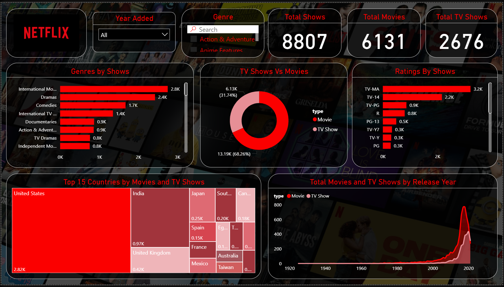

# 📺 Netflix Power BI Dashboard

A visually engaging and data-driven Power BI dashboard analyzing Netflix's extensive collection of Movies and TV Shows. The dashboard allows users to explore trends, genres, ratings, and content distribution across countries and over time.

**Workflow**
- Data subset collected from kaggle: [https://www.kaggle.com/datasets/shivamb/netflix-shows/data](url)
- Data Cleaning through Power Query
- Data Visualization through different charts

**Key Features**
- Filter by Year and Genre (with search option)
- Total Count of Movies, TV Shows, and All Titles
- Identifying Genres by Titles
- Movies vs TV Shows Distribution
- Identifying Ratings by Show ID
- Identifying Top 15 Countries by Movies and TV Shows
- Movies and TV Shows by Release Years

**📸 Dashboard Preview**

## 🧰 Tools Used
- **Power BI Desktop**
- **Power Query (M Language)**
- **DAX (Data Analysis Expressions)**
- Custom visuals, slicers, cards, and formatting enhancements

## 💡 Insights Derived
- Netflix has a higher share of **movies** compared to TV shows.
- **Dramas**, **International Movies**, and **Comedies** dominate content genres.
- **TV-MA** and **TV-14** are the most common content ratings.
- The **United States**, **India**, and **United Kingdom** contribute the highest volume of content.
- Rapid growth in content release post-2010.

## 📬 Contact
Created by **[Amruta Deshmukh]**  
🔗 LinkedIn: ([https://www.linkedin.com/in/amruta-deshmukh-82366a1b1/](url))

⭐ If you like this project, feel free to star the repo and share your feedback!
# Netflix_PowerBI_Dashboard
A Power BI dashboard exploring Netflix TV shows and movies dataset.
